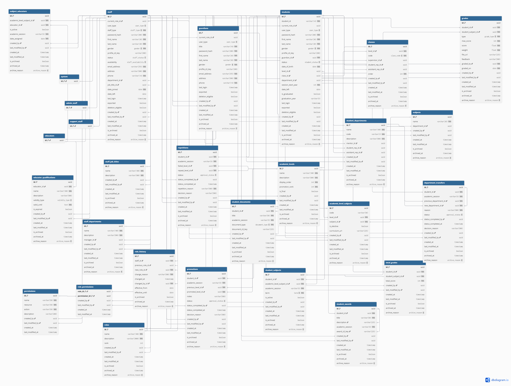

# Kademia

A modular, scalable backend system for managing academic institutions. 
Built as a learning project to explore complex authorization patterns, data lifecycle management, and enterprise-grade architectural patterns.

## Core Architecture

- Repository + Factory + Service layering
- Decorator-based error and FK/unique violation handling
- SQLAlchemy + PostgreSQL with Redis for token tracking
- Archival system and with soft-deletion and restoring of entities

## Tech Stack

| Layer | Technology             |
|-------|------------------------|
| Runtime | Python 3.11            |
| Framework | FastAPI                |
| ORM | SQLAlchemy 2.0         |
| Database | PostgreSQL             |
| Cache | Redis (token tracking) |
| Migrations | Alembic                |

---

## Architecture Overview

### Three-Layer Pattern

```
┌─────────────────────────────────────────────────────────────┐
│                        ROUTERS                              │
│           HTTP endpoints, request validation                │
└─────────────────────────────────────────────────────────────┘
                              │
                              V
┌─────────────────────────────────────────────────────────────┐
│                        SERVICES                             │
│         Business logic, orchestration, validation           │
└─────────────────────────────────────────────────────────────┘
                              │
                              V
┌─────────────────────────────────────────────────────────────┐
│                  FACTORIES AND REPOSITORIES                 │
│            Data access, Object creation, persistence        │
└─────────────────────────────────────────────────────────────┘
```
---

## Database Design

### Domain Model (25 Tables, 9 Domains)



See full [database documentation](documentation/database_design.md)

### User Type Hierarchy

Three distinct user types with different complexity needs:

| User Type | Complexity | Access Pattern |
|-----------|------------|----------------|
| **Staff** | High | Dynamic role-based permissions via RBAC |
| **Student** | Low | Own records only (grades, documents, awards) |
| **Guardian** | Low | Ward records only (linked students) |

Staff uses polymorphic inheritance with `staff_type` as discriminator:

```
Staff (base table)
├── Educator   ->> qualifications, subject assignments, class supervision
├── AdminStaff ->> administrative functions
├── SupportStaff ->> support functions
└── System     ->> bootstrap operations (UUID: 00000000-...)
```

### Common Mixins

All entities inherit standardized behaviors:

| Mixin | Fields | Purpose |
|-------|--------|---------|
| **AuditMixins** | `created_by`, `last_modified_by` | Track who changed what |
| **TimeStampMixins** | `created_at`, `last_modified_at` | Track when changes occurred |
| **ArchiveMixins** | `is_archived`, `archived_at`, `archive_reason` | Soft deletion support |

---

## Data Lifecycle Management

### Removal Types

| Type | Behavior | Access | Use Case |
|------|----------|--------|----------|
| **Archive** | `is_archived=true`, preserves forever | Authorized | Graduation, resignation |
| **Safe Delete** | Delete only if no dependencies | Authorized | Cleanup unused entities |
| **Hard Delete** | Force delete with cascade | Superuser | Data purge (requires export) |

### Ownership Model

The system distinguishes between **owned** and **referenced** relationships:

**Owned (CASCADE)**:  Parent deletion cascades to children:
```
Student OWNS ->> grades, documents, awards, enrollments, promotions, repetitions
Educator OWNS ->> qualifications, subject_assignments
```

**Referenced (SET NULL)**:  Shared resources, deletion clears reference:
```
Staff USES ->> department, job_title, role
Student USES ->> level, class, department
```

**Protected (RESTRICT)**:  Deletion blocked until handled:
```
Guardian ← students (must reassign wards first)
Subject ← academic_level_subjects (must archive subjects first)
```

### Assignment vs Ownership Separation

When archiving staff/students, the system:

1. **Unassigns** from roles (supervisor, mentor, representative) ->> SET NULL
2. **Cascade archives** owned entities (grades, qualifications) ->> is_archived=true

This prevents archived entities from holding active assignments while preserving data integrity.

See full [documentation](documentation/lifecycle.md)

### Dependency Configuration

All deletion rules centralized in `dependency_config.py`:

```python
DEPENDENCY_CONFIG = {
    Student: [
        ("grades", Grade, "student_id", "grades"),
        ("documents_owned", StudentDocument, "student_id", "documents"),
        ("awards_earned", StudentAward, "student_id", "awards"),
        # ... all owned relationships
    ],
    Guardian: [
        ("wards", Student, "guardian_id", "wards"),  # RESTRICT
    ],
}
```

Services check this config before any archive/delete operation:

```
Archive Request ->> Check Dependencies ->> Block or Cascade ->> Commit
```

---


### Polymorphic Staff Inheritance
Joined table inheritance handles role-specific complexity. Educators have rich relationships (qualifications, assignments, mentorships) while other staff types stay lightweight.

### Audit-First Design
Every entity tracks `created_by`, `modified_by`, `archived_by` with enum-based reasons. Critical for educational compliance and accountability.

### Decorator-Based Error Handling
Domain-specific exceptions with middleware translation. FK violations and unique constraints handled via decorators for consistent, user-friendly messages:

```python
@handle_write_errors("create")
def create(self, entity: T) -> T:
    # FK/unique violations automatically caught and translated
```


---

## Core Modules

### Identity Management
- Staff hierarchy with polymorphic inheritance
- Student-Guardian relationships (one guardian ->> many wards)
- Role assignment with full audit history

### Academic Structure
- Academic levels with promotion ranking
- Classes with supervisor and student representatives
- Student departments (Science, Arts, Commercial) with mentors

### Curriculum
- Base subjects linked to departments
- Academic level + Subject combinations (curriculum entries)
- Student enrollment and educator assignment per session/term

### Assessment
- Individual grades with type (exam, test, assignment)
- Weighted scoring with max_score and actual score
- TotalGrade aggregation per subject enrollment

### Progression
- Promotion workflows with approval status
- Repetition tracking with reason documentation
- Department transfers with audit trail

### Documents & Awards
- Student document management with S3 storage
- Award tracking per academic session

---

## Project Structure

```
app/
├── core/
│   ├── identity/          
│   ├── academic_structure/ 
│   ├── curriculum/        
│   ├── assessment/        
│   ├── progression/       
│   ├── transfer/          
│   ├── rbac/              
│   └── shared/          
│   ├── infra/
│        ├── terraform/
│        ├── db/
│          └── db/
│
│             └── repositories/
│              └── migration/
│
 ──────────── middleware
     
```


## Status

Currently in **Phase 4: Authentication & RBAC**:  implementing permission matrix, role hierarchy, and authorization decorators.

See [roadmap](documentation/workflow.md) for progress tracking.
